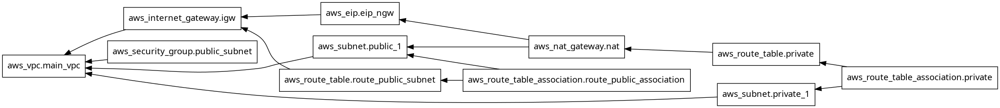

# IaC-tiered-app

An infrastructure as code project using Terraform on AWS

Many AWS services are used like: VPC, public and private subnets, EC2, and ELB (elastic load balancer)

Features of project:
- remote state
- workspaces
- separate variables

**Note:**
This project used Terraform resource blocks at the start ([resources branch](https://github.com/jupiter-commits/IaC-tiered-app/tree/resources)), but later decided to utilize the vpc module to be more modular and avoid repeating blocks

Network resources for subnets and route tables look like this:
